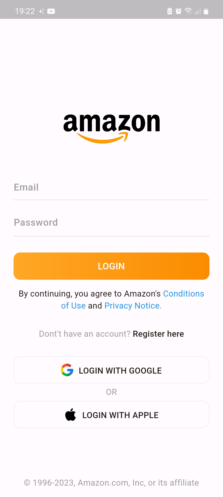
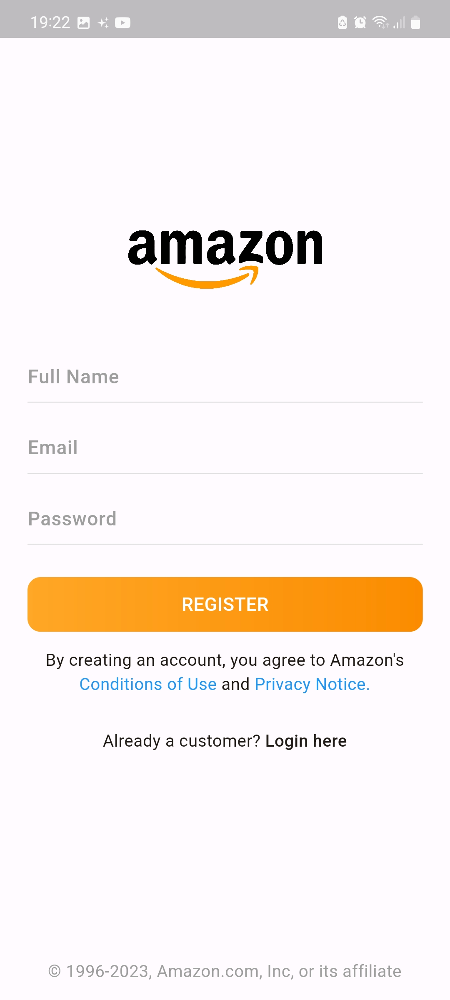
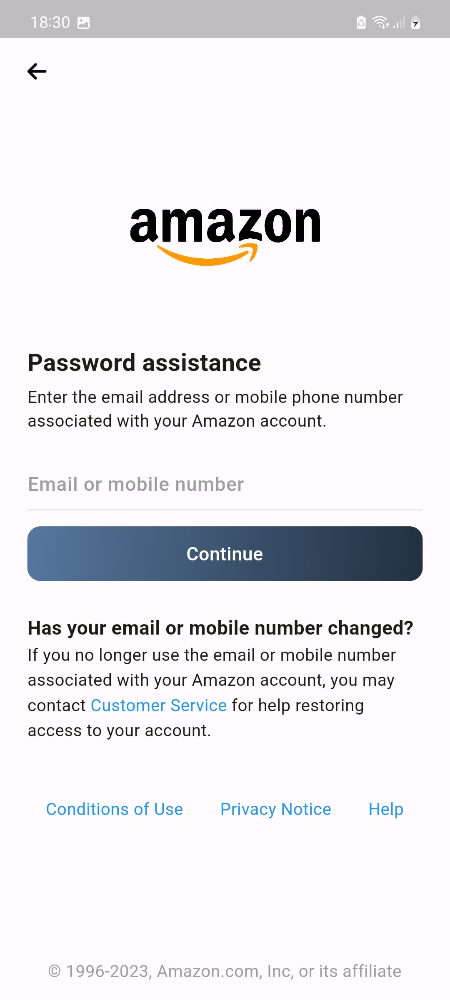
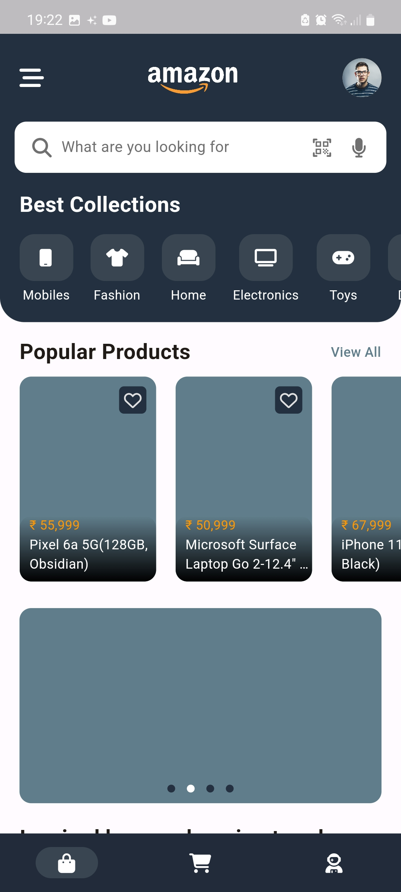
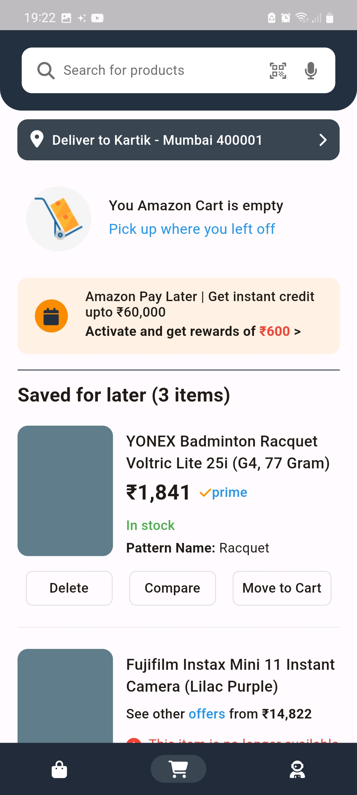
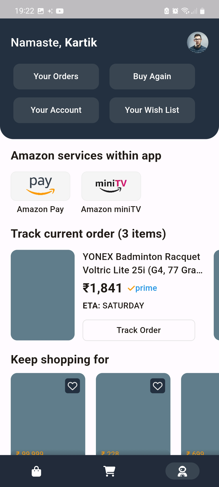

# Amazon App Redesign
#### This project is a partial visual redesign of the Amazon app using Flutter, a popular cross-platform framework for building mobile applications. The goal of this project is to create a visually appealing and user-friendly interface for the Amazon app.

 

## Project Structure
 #### The project structure is organized in the following way:

 #### lib: contains the main Dart code for the application
 #### pages: contains the different screens for the application
 #### common: contains the various common widgets used throughout the application
 #### assets/images: contains any necessary images used in the application 

 

## Installation
Clone the repository using the following command:
    
    git clone https://github.com/iamkartiknayak/UI_Flutter_Amazon_Redesign
    
## Rename the project directory before running flutter commands
    mv UI_Flutter_Amazon_Redesign amazon_redesign

## Navigate to the project directory:
    cd amazon_redesign

## Install the dependencies:
    flutter pub get

## Run the application:
    flutter run

 

## Features
### This Amazon redesign includes the following screens:

* #### A Login screen where user can login
* #### A Register screen where users can register
* #### A Forgot password screen where users can recover lost password
* #### A Shop screen where users can explore products
* #### A Cart screen where users can see cart items
* #### A You screen where users can track order and see account relaed info

 

## Screenshots
Login Screen &nbsp;&nbsp;&nbsp;&nbsp;&nbsp;&nbsp;&nbsp;&nbsp;&nbsp;&nbsp;&nbsp;&nbsp;&nbsp;&nbsp;&nbsp;&nbsp;&nbsp;&nbsp;&nbsp;&nbsp;&nbsp;&nbsp;&nbsp;&nbsp;&nbsp;&nbsp;&nbsp;&nbsp;&nbsp;&nbsp;&nbsp;&nbsp;&nbsp;&nbsp;&nbsp;&nbsp;&nbsp;&nbsp;&nbsp;&nbsp;&nbsp;&nbsp;&nbsp;&nbsp;&nbsp;&nbsp;&nbsp;&nbsp;&nbsp;&nbsp;&nbsp;&nbsp;&nbsp;&nbsp; Register Screen &nbsp;&nbsp;&nbsp;&nbsp;&nbsp;&nbsp;&nbsp;&nbsp;&nbsp;&nbsp;&nbsp;&nbsp;&nbsp;&nbsp;&nbsp;&nbsp;&nbsp;&nbsp;&nbsp;&nbsp;&nbsp;&nbsp;&nbsp;&nbsp;&nbsp;&nbsp;&nbsp;&nbsp;&nbsp;&nbsp;&nbsp;&nbsp;&nbsp;&nbsp;&nbsp;&nbsp;&nbsp;&nbsp;&nbsp;&nbsp;&nbsp;&nbsp;&nbsp;&nbsp;&nbsp;&nbsp;&nbsp;&nbsp;&nbsp; Forgot Password Screen

 &nbsp;&nbsp;&nbsp;&nbsp;&nbsp;
 &nbsp;&nbsp;&nbsp;&nbsp;&nbsp;
  

Shop Screen &nbsp;&nbsp;&nbsp;&nbsp;&nbsp;&nbsp;&nbsp;&nbsp;&nbsp;&nbsp;&nbsp;&nbsp;&nbsp;&nbsp;&nbsp;&nbsp;&nbsp;&nbsp;&nbsp;&nbsp;&nbsp;&nbsp;&nbsp;&nbsp;&nbsp;&nbsp;&nbsp;&nbsp;&nbsp;&nbsp;&nbsp;&nbsp;&nbsp;&nbsp;&nbsp;&nbsp;&nbsp;&nbsp;&nbsp;&nbsp;&nbsp;&nbsp;&nbsp;&nbsp;&nbsp;&nbsp;&nbsp;&nbsp;&nbsp;&nbsp;&nbsp;&nbsp;&nbsp;&nbsp; Cart Screen &nbsp;&nbsp;&nbsp;&nbsp;&nbsp;&nbsp;&nbsp;&nbsp;&nbsp;&nbsp;&nbsp;&nbsp;&nbsp;&nbsp;&nbsp;&nbsp;&nbsp;&nbsp;&nbsp;&nbsp;&nbsp;&nbsp;&nbsp;&nbsp;&nbsp;&nbsp;&nbsp;&nbsp;&nbsp;&nbsp;&nbsp;&nbsp;&nbsp;&nbsp;&nbsp;&nbsp;&nbsp;&nbsp;&nbsp;&nbsp;&nbsp;&nbsp;&nbsp;&nbsp;&nbsp;&nbsp;&nbsp;&nbsp;&nbsp;&nbsp;&nbsp;&nbsp;&nbsp;&nbsp;&nbsp;&nbsp; You Screen

 &nbsp;&nbsp;&nbsp;&nbsp;&nbsp;
 &nbsp;&nbsp;&nbsp;&nbsp;&nbsp;
  

## License
This project is licensed under the MIT License. Feel free to use, modify, and distribute the code as per the terms of the license.

## Acknowledgements
This redesign of the Amazon app was created as a personal project, inspired by the original Amazon app design. Special thanks to the Flutter community for their valuable resources and support in building this application.

## Conclusion
#### This Amazon redesign is a demonstration of how Flutter can be used to create beautiful and functional user interfaces. The code is open source and can be used as a starting point for your own Flutter projects.
